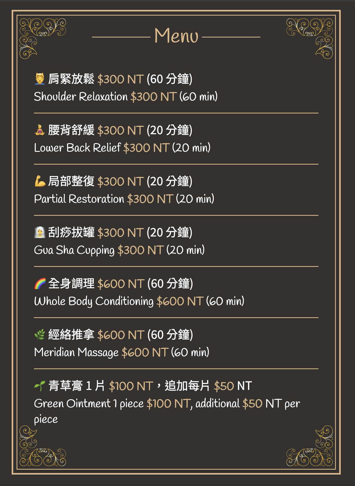

# Menu

幫家人製作的菜單，使用 HTML + CSS 來製作，因為資料量少所以就沒特別用 JS 來做動態渲染了。

## 使用方式

1. 使用 `git clone` 此專案到你的電腦
2. 啟動 liver sever，到畫面上確認資料是否正確
3. 利用瀏覽器的「列印」功能，並將「其他設定 > 邊界」設為「無」以後，以及「其他設定 > 選項 > 背景圖形」打勾後，再將網頁儲存為 PDF（A4 格式）後，即可獲得菜單的 PDF 檔案
4. 把 PDF 檔拿去列印，即完成。

註：若希望印出來是正反面（雙面需求），可 Google 搜尋關鍵字：「PDF 合併」，把多個 PDF 合併起來即可。
